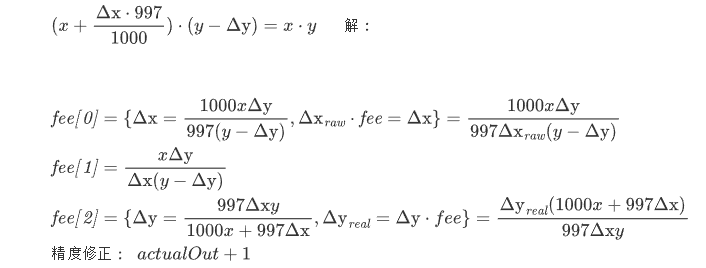

# sol-uni2-abacus
UniswapV2税点计算(貔貅/蜜罐检测)

# 背景
在开发某自动交易机器人时需要获取准确税点，于是根据UniswapV2买卖公式推导出税点的计算公式。

Ps: 市面上检测貔貅用到的方法准确度不高，池子越浅偏差越大，精确计算方法的推导公式见文章末尾。

# 预览
- 买卖税计算/貔貅检测/蜜獾检测

# 快速入门
1. 基础环境
```properties
# 第一步 安装依赖
npm i
# 第二步 准备私钥: 在工程目录下新建 .env 文件，样例:
bscTest=06e4ba3da81342545e60108a576ef5590ee56800ef285bd692923b696f05fa44
bsc=06e4ba3da81342545e60108a576ef5590ee56800ef285bd692923b696f05fa44
# 第三步: 部署合约: 以bscTest测试网为例
npx hardhat --network bscTest run script/deploy.ts
# npx hardhat --network bsc run script/deploy.ts
```
2. 测试样例
> 详见 test/test.ts
```cmd
错误代码: 无
买税: 0.00%
卖税: 0.00%
路由税: 0.20%
```
```ts
class Abacus {
    web3: Web3
    abacus: Contract
    from: string | undefined
    weth: string
    router: string

    constructor(rpc: string, router: string, abacusAddress: string, weth: string, from ?: string) {
        this.web3 = new Web3(rpc)
        this.from = from
        this.abacus = new this.web3.eth.Contract(this.abi, abacusAddress)
        this.weth = weth
        this.router = router
    }

    check = async (value: bigint, token: string, amount: bigint) => {
        let callReq = this.abacus.methods["check"]([this.weth, token], this.router, amount).encodeABI();
        let callRes = await this.web3.eth.call({
            from: this.from ?? "0x0000000000000000000000000000000000001004",
            to: this.abacus.options.address,
            value: value.toString(),
            data: callReq
        });
        let data = this.web3.eth.abi.decodeParameters(this.outputs, callRes);
        return {
            errcode: data.errcode,
            buy: this.feeRatio(data.fees[2]),
            sell: this.feeRatio(data.fees[0]),
            router: this.feeRatio(data.fees[1]),
        }
    }

    feeRatio = (BP: number) => {
        return ((10000 - BP) / 100).toFixed(2)
    }

    abi:any = [{"anonymous":false,"inputs":[{"indexed":false,"internalType":"uint8","name":"version","type":"uint8"}],"name":"Initialized","type":"event"},{"anonymous":false,"inputs":[{"indexed":true,"internalType":"address","name":"previousOwner","type":"address"},{"indexed":true,"internalType":"address","name":"newOwner","type":"address"}],"name":"OwnershipTransferred","type":"event"},{"anonymous":false,"inputs":[{"indexed":false,"internalType":"address","name":"user","type":"address"},{"indexed":false,"internalType":"address","name":"WETH","type":"address"}],"name":"SetWETH","type":"event"},{"inputs":[],"name":"WETH","outputs":[{"internalType":"address","name":"","type":"address"}],"stateMutability":"view","type":"function"},{"inputs":[{"internalType":"address[]","name":"path","type":"address[]"},{"internalType":"address","name":"router","type":"address"},{"internalType":"uint256","name":"amount","type":"uint256"}],"name":"check","outputs":[{"internalType":"uint256[]","name":"fees","type":"uint256[]"},{"internalType":"uint256","name":"errcode","type":"uint256"}],"stateMutability":"payable","type":"function"},{"inputs":[{"internalType":"address[]","name":"path","type":"address[]"},{"internalType":"address","name":"router","type":"address"},{"internalType":"address","name":"pair","type":"address"},{"internalType":"uint256","name":"fee1","type":"uint256"},{"internalType":"uint256","name":"amountIn","type":"uint256"}],"name":"checkBuy","outputs":[{"internalType":"uint256","name":"fee","type":"uint256"}],"stateMutability":"nonpayable","type":"function"},{"inputs":[{"internalType":"address[]","name":"path","type":"address[]"},{"internalType":"address","name":"router","type":"address"},{"internalType":"address","name":"pair","type":"address"}],"name":"checkRouter","outputs":[{"internalType":"uint256","name":"fee","type":"uint256"}],"stateMutability":"view","type":"function"},{"inputs":[{"internalType":"address[]","name":"path","type":"address[]"},{"internalType":"address","name":"router","type":"address"},{"internalType":"address","name":"pair","type":"address"},{"internalType":"uint256","name":"fee1","type":"uint256"}],"name":"checkSell","outputs":[{"internalType":"uint256","name":"fee","type":"uint256"}],"stateMutability":"nonpayable","type":"function"},{"inputs":[{"internalType":"address","name":"weth","type":"address"}],"name":"initialize","outputs":[],"stateMutability":"nonpayable","type":"function"},{"inputs":[],"name":"owner","outputs":[{"internalType":"address","name":"","type":"address"}],"stateMutability":"view","type":"function"},{"inputs":[],"name":"renounceOwnership","outputs":[],"stateMutability":"nonpayable","type":"function"},{"inputs":[{"internalType":"address","name":"weth","type":"address"}],"name":"setWETH","outputs":[],"stateMutability":"nonpayable","type":"function"},{"inputs":[{"internalType":"address","name":"newOwner","type":"address"}],"name":"transferOwnership","outputs":[],"stateMutability":"nonpayable","type":"function"}]
    outputs:any =[
        { internalType: 'uint256[]', name: 'fees', type: 'uint256[]' },
        { internalType: 'uint256', name: 'errcode', type: 'uint256' }
    ]
}
```
# 公式推导

